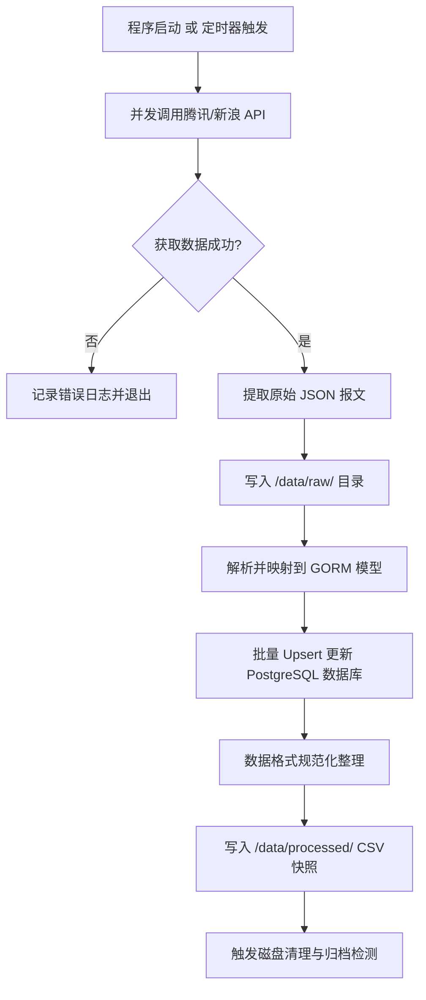

# 数据提取与本地存储设计方案 (Data Pull & Local Storage Plan)

## 1. 存储架构设计 (Storage Architecture)

本地数据存储采用 **“双层架构”** 方案：
1. **原始层 (Raw JSON)**：直接保存自腾讯/新浪 API 获取的完整原始 HTTP 响应，用作审计、排查故障以及重新解析的备份。
2. **分析层 (Processed CSV/Parquet)**：经过清洗、去重和转换后的结构化数据，方便 Python (Pandas/NumPy)、DuckDB 或 BI 工具直接读取分析。

### 1.1 目录结构设计
数据存储在后端程序的 `data/` 目录下，按数据类型与日期划分子目录：

```text
backend/
├── data/
│   ├── raw/                           # 原始数据备份（JSON 格式）
│   │   ├── YYYY-MM-DD/
│   │   │   ├── cn_stocks_raw_HHMMSS.json
│   │   │   ├── hk_stocks_raw_HHMMSS.json
│   │   │   └── indices_raw_HHMMSS.json
│   ├── processed/                     # 分析层数据（CSV / Parquet 格式）
│   │   ├── YYYY-MM-DD/
│   │   │   ├── cn_stocks_HHMMSS.csv
│   │   │   ├── hk_stocks_HHMMSS.csv
│   │   │   └── indices_HHMMSS.csv
│   │   └── monthly_archive/           # 按月归档压缩包
│   │       └── 2026-06.zip
```

### 1.2 命名规范
文件名包含业务前缀、数据类型及高精度时间戳，确保唯一性且易于排序：
* **A股股票**：`cn_stocks_[raw]_[YYYYMMDD]_[HHMMSS].[json|csv]`
* **港股股票**：`hk_stocks_[raw]_[YYYYMMDD]_[HHMMSS].[json|csv]`
* **大盘股指**：`indices_[raw]_[YYYYMMDD]_[HHMMSS].[json|csv]`

---

## 2. 数据格式与字段设定 (Data Formats & Schemas)

### 2.1 大盘指数数据 (Indices)
记录国内外核心指数的最新状态，用于大盘强弱及跨市场联动性分析。

#### 字段定义 (CSV)
| 字段名 (Field) | 类型 (Type) | 示例值 (Example) | 说明 (Description) |
| :--- | :--- | :--- | :--- |
| `timestamp` | int64 | `1781157600` | Unix 秒级时间戳 |
| `code` | string | `HSI` / `000001` | 指数唯一代码 |
| `qtcode` | string | `hkHSI` / `sh000001` | 腾讯/新浪行情代码 |
| `name` | string | `恒生指数` / `上证指数` | 指数名称 |
| `location` | string | `香港` / `上海` | 交易所归属地 |
| `zxj` | float64 | `18456.22` | 最新点数 |
| `zd` | float64 | `-124.50` | 涨跌额 |
| `zdf` | float64 | `-0.67` | 涨跌幅 (%) |
| `state` | string | `open` / `close` | 交易状态 |

---

### 2.2 股票行情数据 (Stocks)
针对 A 股和港股建立详细的日终或准实时快照数据。

#### 字段定义 (A股 & 港股通用分析格式)
| 字段名 (Field) | 类型 (Type) | 示例值 (Example) | 说明 (Description) |
| :--- | :--- | :--- | :--- |
| `timestamp` | int64 | `1781157600` | 数据落地时间戳 |
| `market` | string | `CN` / `HK` | 市场标识 (中国大陆/中国香港) |
| `board` | string | `main` / `cyb` / `kcb` / `gem` | 板块类别 (主板/创业板/科创板/北交所) |
| `code` | string | `600519` / `00700` | 股票代码 (不含市场前缀) |
| `full_code` | string | `sh600519` / `hk00700` | 包含市场前缀的唯一代码 |
| `name` | string | `贵州茅台` / `腾讯控股` | 股票简称 |
| `zxj` | float64 | `1650.00` | 最新价 (本地货币) |
| `zd` | float64 | `12.50` | 涨跌额 |
| `zdf` | float64 | `0.76` | 涨跌幅 (%) |
| `hsl` | float64 | `0.45` | 换手率 (%) |
| `zf` | float64 | `1.22` | 振幅 (%) |
| `volume` | float64 | `1520400` | 成交量 (股) |
| `turnover` | float64 | `2508660000` | 成交额 (元，本地货币) |
| `ltsz` | float64 | `20727.45` | 流通市值 (万元，本地货币) |
| `zsz` | float64 | `20727.45` | 总市值 (万元，本地货币) |
| `pe` | float64 | `28.45` | 市盈率 (PE TTM / PE Ratio) |
| `state` | string | `open` / `suspend` | 交易状态 (正常交易/停牌) |

> [!NOTE]
> * 腾讯 API 返回的港股成交量单位为“股”，成交额单位为“元”；而 A 股成交量单位通常为“手”（1手=100股），成交额单位为“万元”。
> * **本地存储规范**：为了保证量化回测的方便，本地 Processed 文件统一将成交量转换为 **“股 (Share)”**，成交额与市值统一转换为 **“元 (Currency Value)”** 或 **“万元 (10k Currency Value)”**，并在文档中明示。

---

## 3. 数据提取与写入流程 (Workflow)



### 3.1 异步非阻塞写入
Go 后端在接收到启动同步或定时触发同步时，应在独立的 **Goroutine** 中执行本地文件存盘操作，避免阻塞 API 服务的主线程响应：

```go
// 伪代码示例：在后台协程中进行文件落盘
go func(rawData []byte, processedStocks []models.Stock) {
    // 1. 保存 raw json
    saveRawJSON(rawData)
    
    // 2. 转换为规范 CSV 并保存
    saveProcessedCSV(processedStocks)
    
    // 3. 执行归档清理检查
    checkAndArchive()
}(responseBytes, stocksList)
```

---

## 4. 存储生命周期管理 (Lifecycle & Clean-up)

由于每日多次同步或长期运行会占用大量的磁盘空间，必须建立本地文件的自动清理与压缩机制：

1. **热数据保留期 (Hot Period)**：
   * 本地 `data/raw/` 和 `data/processed/` 目录保留最近 **30天** 的明细数据文件，方便随时读取。
2. **冷数据归档期 (Archive Period)**：
   * 超过 30 天的数据，按月将 `raw` 和 `processed` 目录打包压缩为 `.zip` 或 `.tar.gz` 存放在 `monthly_archive/` 中。
3. **过期清理期 (Purge Period)**：
   * 本地冷数据归档保留最近 **12个月**，超过 1年的归档文件自动清理（或迁移到外部云存储如 S3/OSS 中）。
   * 数据库中的历史快照可根据需要保留更久，本地文件系统只作为高效缓存和轻量数据仓库。

---

## 5. 数据质量保证与监控 (Monitoring & QA)

1. **断点保护与校验**：
   * 写入 CSV 后，需读取并校验文件大小及行数是否与 API 返回的 `total` 一致。
   * 如果文件大小为 0 或行数小于阈值（例如 A 股股票少于 5000 行，港股少于 2000 行），则判定为异常，发送报警并保留前一日的备份。
2. **容灾逻辑**：
   * 若 API 临时故障或返回空数据，后端程序将自动使用最新生成的本地 CSV 数据做临时缓存，确保前端展示不中断。
