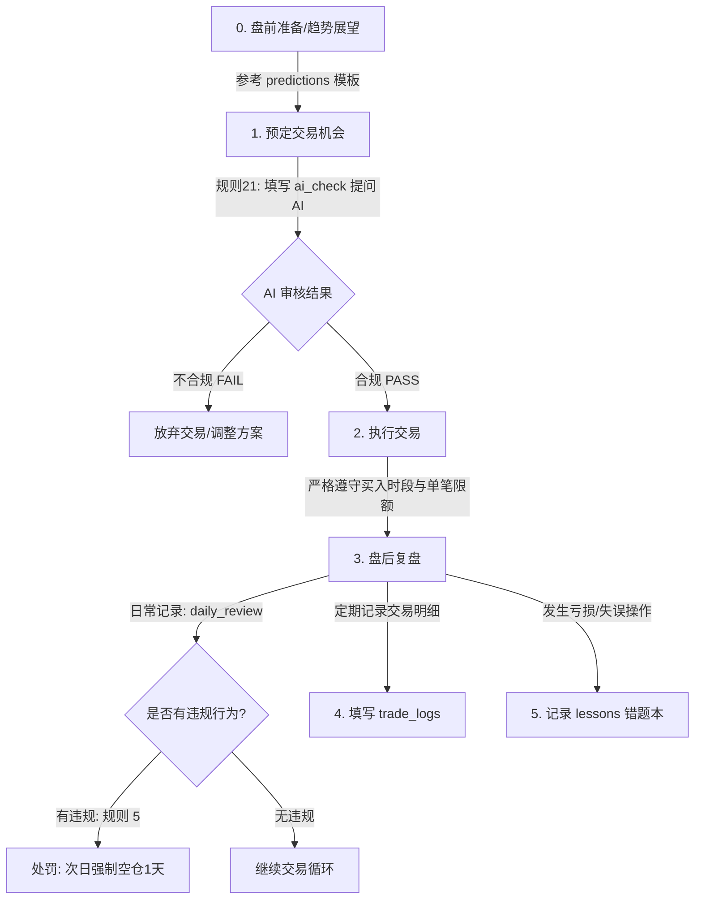

# 投资复盘与交易纪律系统

本系统旨在协助交易者严格执行 `rule.md` 中定义的投资纪律，记录交易心路历程，开展市场预测与自我修正。

## 目录结构说明

```text
review/
├── README.md                 # 系统导览与复盘流程指引
├── rule.md                   # 黄金交易纪律与熔断惩罚规则
├── ai_check/                 # AI 冷水机审查模块（规则 21）
│   └── template.md           # 盘前/交易前 AI 合规审查提问模板
├── daily_review/             # 日复盘目录（规则 5）
│   └── template.md           # 每日盘后复盘模板
├── predictions/              # 未来预测与趋势展望目录
│   └── template.md           # 周度/月度/季度市场预测与自选股分析模板
├── trade_logs/               # 交易账本与统计目录
│   └── template.md           # 结构化交易记录模板
└── lessons/                  # 错题本与交易反思目录
    └── template.md           # 错误交易剖析与教训沉淀模板
```

---

## 每日交易与复盘标准工作流 (Workflow)



### 步骤详细说明：

1. **交易前合规审查 (AI冷水机)**：
   在任何买入或卖出动作前，复制 [ai_check/template.md](file:///d:/doc/workspace/StockTraces/review/ai_check/template.md) 模板，填入计划交易的信息，发送给 AI。只有在 AI 判定 **PASS（合规）** 且自己情绪冷静时，才可操作。
2. **交易执行**：
   交易时点必须严格限定在早盘（`9:30 - 10:00`）或尾盘（`14:30 - 15:00`），日买入上限 1 笔，单笔资金不得超过 5%。
3. **盘后日复盘**：
   每日 15:00 收盘后，必须使用 [daily_review/template.md](file:///d:/doc/workspace/StockTraces/review/daily_review/template.md) 模板建立当天的复盘文档（例如 `2026-06-10.md`）。**重点审查当天是否存在任何违规**（如凭感觉下单、非交易时段买入、突破笔数等）。
4. **违规熔断处罚**：
   一旦在复盘中发现有违规行为，无论当笔交易输赢，次日必须**强制空仓 1 天**，不进行任何买卖。
5. **错题反思 (lessons)**：
   凡是触发了 10% 斩仓止损的个股，或由于情绪失控导致的非理性交易，必须单独在 `lessons/` 下建立案例分析，防范未来重犯。
