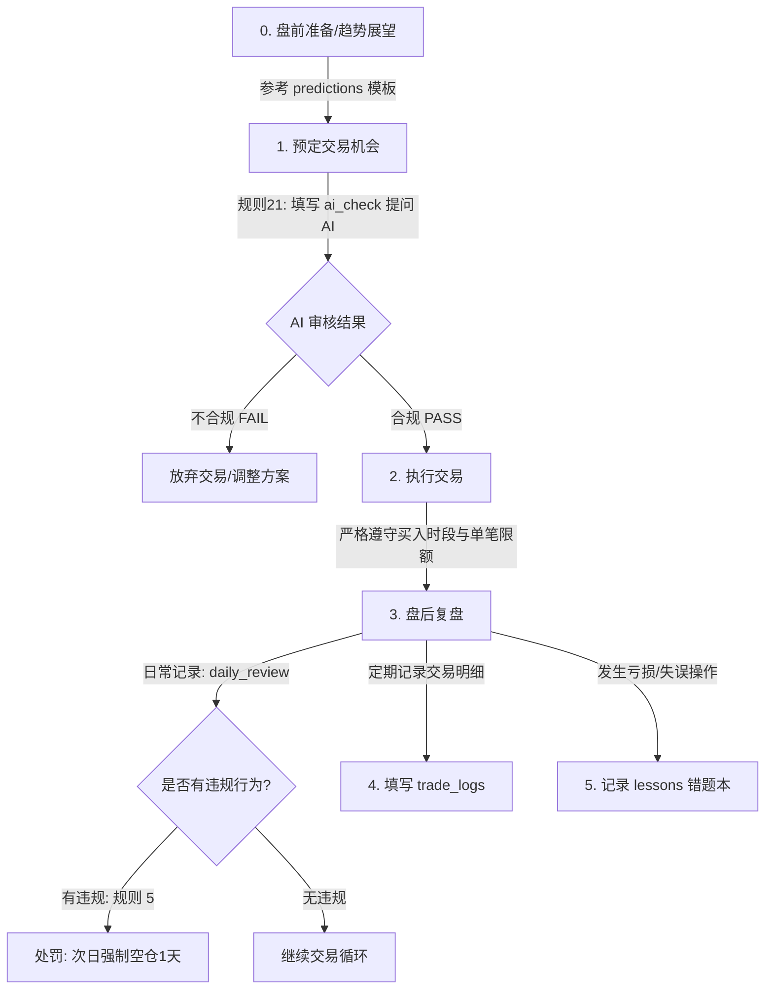

# 投资复盘与交易纪律系统

本系统旨在协助交易者严格执行 `rule.md` 中定义的投资纪律，记录交易心路历程，开展市场预测与自我修正。

## 目录结构说明

```text
review/
├── README.md                 # 系统导览与复盘流程指引
├── rule.md                   # 黄金交易纪律与熔断惩罚规则
├── ai_check/                 # AI 冷水机审查模块（规则 21）
│   └── template.md           # 盘前/交易前 AI 合规审查提问模板
├── daily_review/             # 日复盘目录（规则 5）
│   └── template.md           # 每日盘后复盘模板
├── predictions/              # 未来预测与趋势展望目录
│   └── template.md           # 周度/月度/季度市场预测与自选股分析模板
├── trade_logs/               # 交易账本与统计目录
│   └── template.md           # 结构化交易记录模板
└── lessons/                  # 错题本与交易反思目录
    └── template.md           # 错误交易剖析与教训沉淀模板
```

---

## 每日交易与复盘标准工作流 (Workflow)



## 指令

1.预测一下股市未来，写入今天日期的文件review/predictions